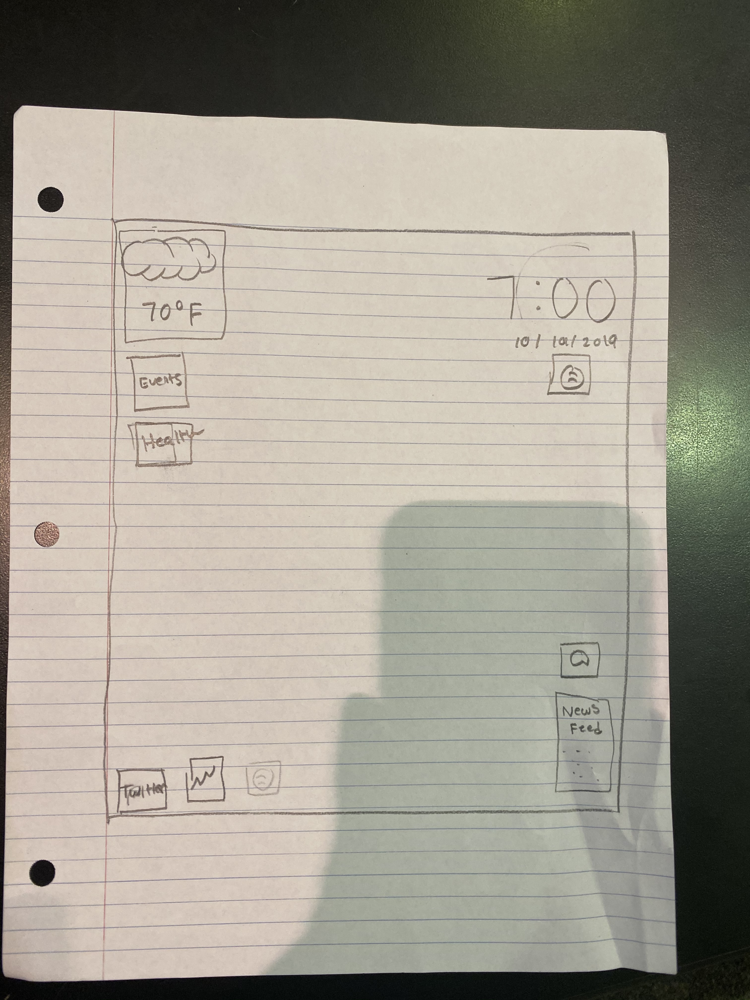
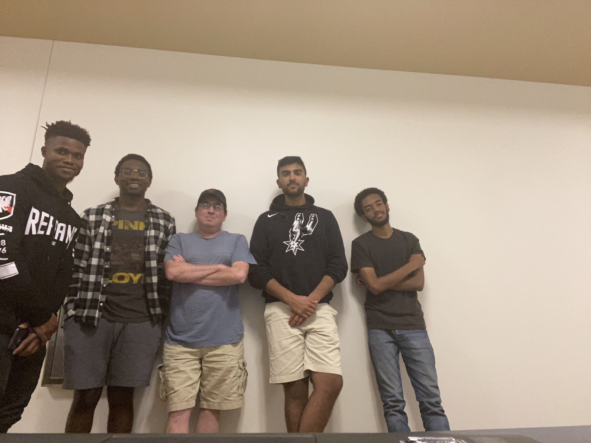

# Presentation

## Sketch

### Functions:

* General information
    * Clock (date and time)
    * Weather
    * Events calendar
    * Health
        *Steps 
    * News feed
    * Messages (SMS)
* Other information
    * Spotify player

## How far did you go with the implementation?
Met up twice to explore the different libraries we need to implement the project. We have also set up the GitHub organization along with the two repositories for the project (presentation, project implementation).

## Plan to move forward
We plan on meeting up at some point this week depending on how our schedule works to try to implement the basic layout.

## Team members
* Jason Mba - Basic layout, Health widget, Message (SMS)
* John Yucetas - Basic layout, Stock market widget, Events calendar
* Ukoh Ndukwo - Basic layout, Clock/date widget
* Pratik Patel - Basic layout, Weather widget
* Michael Kiros - Basic layout, News feed widget, Spotify

////////////////////////////////////////////////////////////////////////////////////////////////////////////////////////////////////////////////////////////////////////////////////////////////////////////////////////////////////////////////////////////////////////////////

## What was actually Implemented? 

* Weather: This widget will show the current weather in Lubbock along with an icon of the representative weather 
* Clock:   This widget shows the current standard central local (Lubbock) time in non-military format 
* Spotify:   This widget is synced to the user's account and will play real time playlist directly from the user's account 
* NewsFeed:   This widget is synced to the New York Times API and will display real time news articles as they are published.  User has the ability to scroll through the news feed 
* Health:  This widget shows a line graph of the user's step history for the week.  
* SMS:   This widget allows the user to send an SMS directly from the widget itself and it will also allow the user to see other converstions in their inbox.  
* Calendar:  This widget allows the user to see all of their events for the week or month.  User the option to display 3 ways.  The first is by the month, so a monthly calander will appear with events for the entirety of the month.  Second is by the week, so user can see specfic tasks by the week along with the time and place that it will be taking place at.  Lastly, is by agenda, so user will only see a list of all tasks currently in the calander.  Also, user has the ability to add a task directly from the widget.  

All of the originally planned implementations were carried out!  

## Contributions

* Jason Mba - Basic layout, Health widget, Message (SMS), Integration and Finalization
* John Yucetas - Basic layout, Events calendar
* Ukoh Ndukwo - Basic layout, Clock/date widget
* Pratik Patel - Basic layout, Weather widget, Presentation
* Michael Kiros - Basic layout, News feed widget, Spotify, Weather, Time/Date/Clock, Integration and Finalization

